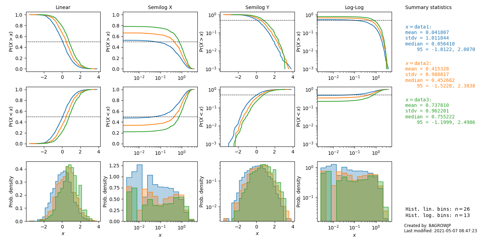
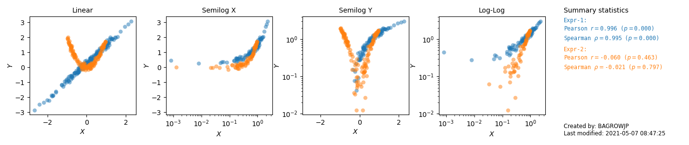

# PLASM - PLot Analysis Spreads for Meetings

Jim Bagrow  
@bagrow  
https://bagrow.com

A rough-and-ready tool for preparing all combinations of log- and linear-scaled axes for a scatterplot or distribution plot (CDF, CCDF, or histogram), to save for reference.

PLASM consists of two Python functions:

- `CHASM` : Cdf and Histogram Analysis Spread for Meetings
- `SPASM` : ScatterPlot Analysis Spread for Meetings

Now when you show a scatter plot to a collaborator during a research meeting and they ask for a log-scaled x-axis,
for instance, you can pull out the saved SPASM and have every combination of
log- and linear-scaled axes ready to go.


## Table of Contents

* [Usage](#usage)
	+ [CHASM](#chasm)
	+ [SPASM](#spasm)
* [Install](#install)
	- [Requirements](#requirements)
* [Frequently asked questions](#frequently-asked-questions)
* [License](#license)

## Usage

Add `plasm` to your code:
```python
from plasm import chasm, spasm
```

### CHASM

Examine some distributions with `chasm`:

```python
n = 1000
X = np.random.randn(n,)
Y = np.random.randn(n,)+0.4
Z = np.random.randn(n,)+0.8

names = ["data1","data2","data3"]
chasm(X, Y, Z, names=names, show_median=True)
```



Now, we looked at three normal (Gaussian) distributions.
A log-scaled x-axis does not make much sense for such distributions and, sure enough, those plots (semilog x and log-log) are not informative in the example. But now we have a spread we can save away just in case we are ever asked for a different axes scaling. 

### SPASM

Scatter plot some data with `spasm`:
```python
n = 150
X1 = np.random.randn(n,)
e  = np.random.randn(n,)*0.1
Y1 = 0.3 + 1.2 * X1 + e

X2 = -1 + 2*np.random.rand(n,)
Y2 = 2*X2**2 + e

spasm(X1,Y1, X2,Y2, names=['Expr-1', 'Expr-2'])
```



## Install

`pip install plasm`

#### Requirements

* Python 3.6+
* Numpy
* Scipy
* Matplotlib 3.x


## Frequently asked questions

* _Why worry about log scales?_

It's very common when performing exploratory data analysis to encounter non-normal data, data that are skewed in some manner. It may be that a few extreme outliers crush the bulk of the data down into an unreadable space. Or it may be that you are looking if data follow a [particular functional form](https://en.wikipedia.org/wiki/Power_law#Power-law_functions), and it may be easier to discern that form with some manner of logarithmically-scaled axes.

* _Can I use this for papers or presentations?_

Generally, no. Or at least, that's not the intent.

The different views in a spread of plots are highly redundant. They show
the same data over and over. In a meeting, internal presentation, or even during your own exploratory data analysis, seeing all these views can be very helpful to teach you the best view.  Then, with that best view in mind, you can design the final plot for your paper.

You can often tell plasm is working by noticing that only a small subset of plots in a spread are useful. For instance, above we show an example using `chasm` to look at three normal distributions. A log-scaled x-axis does not make much sense for such distributions and, sure enough, those plots are not informative in the example. But now we have a spread we can save away just in case we are ever asked for a different axes scaling.


* _Not good for presentations, I thought this was for meetings?_

By meetings, I really mean _internal_ meetings, such as meeting with a research supervisor or some collaborators on a project. I don't mean conferences. By the time you are presenting results at a conference, you should already know which way to plot the data.


* _What if I don't like the defaults?_

Good point. Both CHASM and SPASM accept additional keyword arguments that get passed to the underlying `plot` commands. For example, you can use SPASM to do a line plot instead of a scatter plot by passing an `ls` arg:

```python
spasm(X,Y, ls='-')
```

Of course, there is much more than can be done. Especially for histograms; we have only implemented a basic linear and log-binning, but there are many other ways to go about binning, including integer bins. (That there is so much choice for histogram binning, and that different binnings can change, sometimes drastically, the appearance of the distribution, is a strong argument for relying on the CDF or CCDF!)


* _This is dumb. I could have easily coded it up myself._

True. Now you don't have to. Also, after coding it up, would you have come up with the killer name? :joy:

* _Can I share some ribald comments using other -asm words?_

Please, no.

## License

[BSD-3-Clause](LICENSE) © James Bagrow
